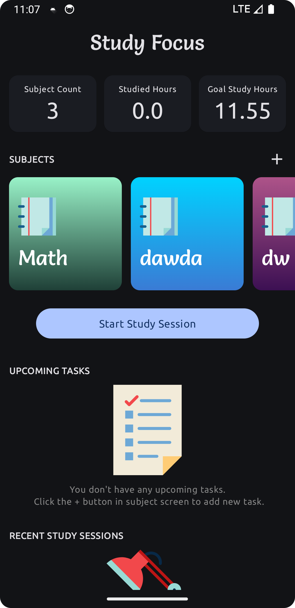
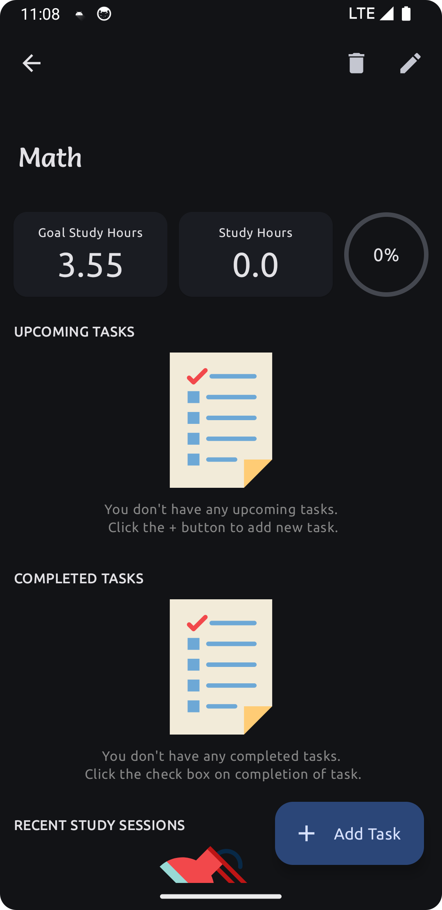
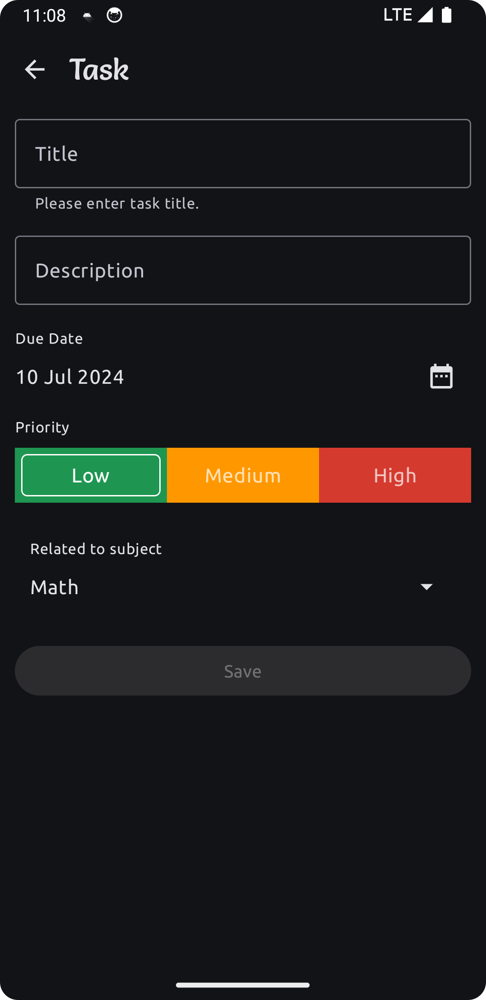
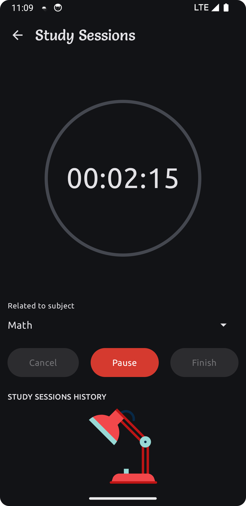

# Study Focus with Jetpack compose

## Tech stack
- Kotlin
- Jetpack Compose
- Viewmodel
- <a href="[url](https://github.com/raamcosta/compose-destinations)">Compose Destinations</a>
- Material 3 (Custom Theme : Light and Dark)
- Koin
- Ktor
- Room
- Coroutine - Flow

<table>
  <tr>
    <th>Dashboard</th>
    <th>Add Subject</th>
    <th>Subject</th>
  </tr>
  <tr>
    <td></td>
    <td></td>
    <td></td>
  </tr>
</table>
<table>
  <tr>
    <th>Task</th>
    <th>Session</th>
    <th>Session Notification</th>
  </tr>
  <tr>
    <td></td>
    <td></td>
    <td></td>
  </tr>
</table>
